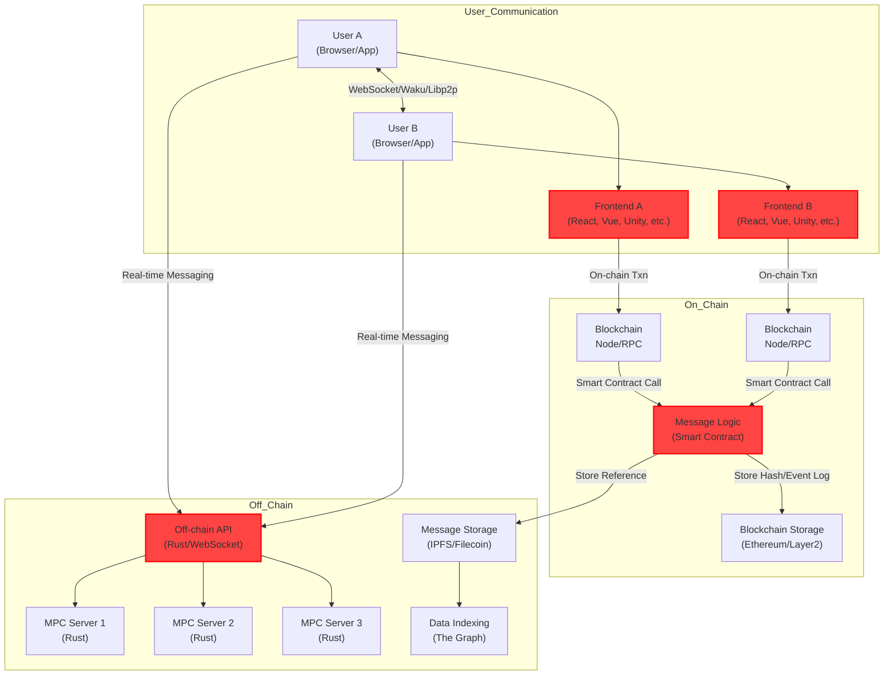

# 🏗 Scaffold-ETH 2

<h4 align="center">
  <a href="https://docs.scaffoldeth.io">Documentation</a> |
  <a href="https://scaffoldeth.io">Website</a>
</h4>

🧪 An open-source, up-to-date toolkit for building decentralized applications (dapps) on the Ethereum blockchain. It's designed to make it easier for developers to create and deploy smart contracts and build user interfaces that interact with those contracts.

⚙️ Built using NextJS, RainbowKit, Foundry, Wagmi, Viem, and Typescript.

## System Architecture



## Deployment Architecture (Cloudflare)

The system is deployed on Cloudflare's infrastructure with the following components:

1. **Frontend (Next.js)**

   - Deployed on Cloudflare Pages
   - Serves the React application
   - Handles client-side routing and UI rendering

2. **Backend (Rust)**

   - Deployed on Cloudflare Workers
   - Handles WebSocket connections
   - Manages real-time communication
   - Uses Cloudflare D1 for data storage

3. **zk-mpc-node**

   - Deployed on Cloudflare Workers
   - Handles zero-knowledge proof computations
   - Uses Cloudflare Durable Objects for state management

4. **Smart Contracts**
   - Deployed on Ethereum/Layer2 networks
   - Interacts with Cloudflare infrastructure via RPC
   - Uses Cloudflare R2 for metadata storage

## Database Architecture

The system uses a combination of Supabase and in-memory storage:

1. **Supabase (PostgreSQL)**

   - User management and authentication
   - Persistent data storage
   - Row Level Security (RLS) enabled

2. **In-Memory Storage**
   - Game state management
   - Real-time communication
   - Temporary data storage

### Database Schema

```sql
-- Supabaseにユーザーテーブルを作成するSQL
-- このスクリプトはSupabaseコンソールのSQL Editorで実行してください

-- ユーザーテーブル
CREATE TABLE IF NOT EXISTS users (
  id UUID PRIMARY KEY,
  username TEXT NOT NULL,
  email TEXT UNIQUE NOT NULL,
  password_hash TEXT NOT NULL,
  created_at TIMESTAMP WITH TIME ZONE NOT NULL,
  updated_at TIMESTAMP WITH TIME ZONE NOT NULL,
  last_login TIMESTAMP WITH TIME ZONE
);

-- RLSポリシーの設定
ALTER TABLE users ENABLE ROW LEVEL SECURITY;

-- 匿名ユーザーが新規ユーザーを作成できるようにする
CREATE POLICY "ユーザー登録を許可" ON users
  FOR INSERT TO anon
  WITH CHECK (true);

-- ユーザー自身のデータのみを取得・更新できるようにする
CREATE POLICY "ユーザーは自分のデータのみ閲覧可能" ON users
  FOR SELECT TO authenticated
  USING (auth.uid() = id);

CREATE POLICY "ユーザーは自分のデータのみ更新可能" ON users
  FOR UPDATE TO authenticated
  USING (auth.uid() = id);

-- メールアドレスによるユーザー検索を許可
CREATE POLICY "メールアドレスによるユーザー検索を許可" ON users
  FOR SELECT TO anon
  USING (true);

-- インデックス作成
CREATE INDEX IF NOT EXISTS users_email_idx ON users (email);
```

## Environment Configuration

### Required Secrets (GitHub Secrets)

以下の値は機密情報として扱い、GitHub Secrets として設定する必要があります：

1. **Cloudflare**

   ```bash
   CF_API_TOKEN=your-cloudflare-api-token  # CloudflareのAPIトークン
   ```

2. **Smart Contracts**

   ```bash
   PRIVATE_KEY=your-deployer-private-key   # コントラクトデプロイ用の秘密鍵
   ```

3. **Supabase**

   ```bash
   SUPABASE_KEY=your-supabase-anon-key     # Supabaseの匿名キー
   JWT_SECRET=your-secure-jwt-secret       # JWT署名用の秘密鍵
   ```

4. **zk-mpc-node**
   ```bash
   MPC_SECRET_KEY=your-mpc-secret-key      # MPCノードの秘密鍵
   MPC_PUBLIC_KEY=your-mpc-public-key      # MPCノードの公開鍵
   ```

### Environment Variables (GitHub Variables)

以下の値は環境変数として設定可能です：

1. **Supabase**

   ```bash
   SUPABASE_URL=https://your-project-id.supabase.co  # SupabaseのプロジェクトURL
   ```

2. **Frontend**

   ```bash
   NEXT_PUBLIC_API_URL=https://zk-werewolf-backend.workers.dev
   NEXT_PUBLIC_WS_URL=wss://zk-werewolf-backend.workers.dev
   NEXT_PUBLIC_SUPABASE_URL=https://your-project-id.supabase.co
   NEXT_PUBLIC_SUPABASE_ANON_KEY=your-supabase-anon-key
   ```

3. **Smart Contracts**

   ```bash
   RPC_URL=your-ethereum-rpc-url  # テストネット/メインネットのRPC URL
   ```

4. **Debug Settings**
   ```bash
   DEBUG_MODE=false
   DEBUG_VERBOSE_LOGGING=false
   DEBUG_SHOW_PLAYER_ROLES=false
   DEBUG_AUTO_ADVANCE_PHASES=false
   DEBUG_PHASE_DURATION_SECONDS=30
   DEBUG_RANDOM_ROLE=false
   DEBUG_CREATE_CRYPTO_PARAMETERS=false
   DEBUG_CREATE_PROOF=false
   DEBUG_DELEGATE_PROOF=false
   ```

### Setting Up Secrets and Variables

1. **GitHub Secrets の設定**

   - リポジトリの Settings > Secrets and variables > Actions に移動
   - "New repository secret"をクリック
   - 上記の Secrets を追加（値は暗号化されて保存）

2. **GitHub Variables の設定**
   - リポジトリの Settings > Secrets and variables > Actions に移動
   - "Variables"タブを選択
   - "New repository variable"をクリック
   - 上記の Variables を追加

### Environment-Specific Configuration

- **Development**

  - すべての DEBUG\_\*変数を true に設定
  - テストネットの RPC URL を使用
  - 開発用 Supabase プロジェクトを使用

- **Staging**

  - 限定的な DEBUG\_\*変数のみ有効
  - テストネットの RPC URL を使用
  - ステージング用 Supabase プロジェクトを使用

- **Production**
  - すべての DEBUG\_\*変数を false に設定
  - メインネットの RPC URL を使用
  - 本番用 Supabase プロジェクトを使用

## Deployment Process

1. **Frontend Deployment**

   ```bash
   cd packages/nextjs
   yarn build
   wrangler pages deploy .next
   ```

2. **Backend Deployment**

   ```bash
   cd packages/server
   wrangler deploy
   ```

3. **zk-mpc-node Deployment**

   ```bash
   cd packages/zk-mpc-node
   wrangler deploy
   ```

4. **Smart Contract Deployment**
   ```bash
   cd packages/foundry
   yarn deploy
   ```

## CI/CD Pipeline

The project uses GitHub Actions for continuous deployment. The workflow:

1. Triggers on push to main branch
2. Sets up Node.js and Rust environments
3. Deploys smart contracts
4. Deploys zk-mpc-node
5. Deploys backend
6. Builds and deploys frontend
7. Updates environment variables
8. Verifies deployment

## Security Considerations

1. **Secret Management**

   - All secrets are encrypted
   - Regular rotation of production keys
   - Minimal required permissions

2. **Access Control**

   - Row Level Security in Supabase
   - JWT-based authentication
   - Secure WebSocket connections

3. **Data Protection**
   - Encrypted data transmission
   - Secure password hashing
   - Regular security audits

## Monitoring and Maintenance

1. **Health Checks**

   - Frontend: `https://zk-werewolf.pages.dev`
   - Backend: `https://zk-werewolf-backend.workers.dev/health`
   - zk-mpc-node: `https://zk-werewolf-mpc.workers.dev/health`

2. **Logging**

   - Cloudflare Workers logs
   - Supabase audit logs
   - Application logs

3. **Backup Strategy**
   - Regular database backups
   - State recovery procedures
   - Disaster recovery plan

- ✅ **Contract Hot Reload**: Your frontend auto-adapts to your smart contract as you edit it.
- 🪝 **[Custom hooks](https://docs.scaffoldeth.io/hooks/)**: Collection of React hooks wrapper around [wagmi](https://wagmi.sh/) to simplify interactions with smart contracts with typescript autocompletion.
- 🧱 [**Components**](https://docs.scaffoldeth.io/components/): Collection of common web3 components to quickly build your frontend.
- 🔥 **Burner Wallet & Local Faucet**: Quickly test your application with a burner wallet and local faucet.
- 🔐 **Integration with Wallet Providers**: Connect to different wallet providers and interact with the Ethereum network.


## Requirements

Before you begin, you need to install the following tools:

- [Node (>= v18.18)](https://nodejs.org/en/download/)
- Yarn ([v1](https://classic.yarnpkg.com/en/docs/install/) or [v2+](https://yarnpkg.com/getting-started/install))
- [Git](https://git-scm.com/downloads)

## Quickstart

To get started with Scaffold-ETH 2, follow the steps below:

1. Install dependencies if it was skipped in CLI:

```
cd my-dapp-example
yarn install
```

2. Run a local network in the first terminal:

```
yarn chain
```

This command starts a local Ethereum network using Foundry. The network runs on your local machine and can be used for testing and development. You can customize the network configuration in `packages/foundry/foundry.toml`.

3. On a second terminal, deploy the test contract:

```
yarn deploy
```

This command deploys a test smart contract to the local network. The contract is located in `packages/foundry/contracts` and can be modified to suit your needs. The `yarn deploy` command uses the deploy script located in `packages/foundry/script` to deploy the contract to the network. You can also customize the deploy script.

4. On a third terminal, start your NextJS app:

```
yarn start
```

Visit your app on: `http://localhost:3000`. You can interact with your smart contract using the `Debug Contracts` page. You can tweak the app config in `packages/nextjs/scaffold.config.ts`.

Run smart contract test with `yarn foundry:test`

- Edit your smart contracts in `packages/foundry/contracts`
- Edit your frontend homepage at `packages/nextjs/app/page.tsx`. For guidance on [routing](https://nextjs.org/docs/app/building-your-application/routing/defining-routes) and configuring [pages/layouts](https://nextjs.org/docs/app/building-your-application/routing/pages-and-layouts) checkout the Next.js documentation.
- Edit your deployment scripts in `packages/foundry/script`

## Repository Structure

This project follows a monorepo structure using Yarn workspaces. Here's an overview of the main directories and their purposes:

```text
.
├── packages/                # Main packages directory
│   ├── zk-mpc-node/         # Zero-knowledge MPC node implementation
│   ├── nextjs/              # Frontend application (Next.js)
│   ├── server/              # Backend server (Rust)
│   └── foundry/             # Smart contract development environment
├── .husky/                  # Git hooks configuration
├── .yarn/                   # Yarn configuration
└── .github/                 # GitHub Actions configuration
```

### Package Details

- **zk-mpc-node/**

  - Zero-knowledge proof and MPC implementation
  - Handles secure computation and verification

- **nextjs/**

  - Frontend user interface
  - Built with Next.js and React
  - Integrates with smart contracts and backend

- **server/**

  - Backend API server
  - Implemented in Rust
  - Handles business logic and data management

- **foundry/**
  - Smart contract development environment
  - Contract compilation and deployment
  - Testing and verification tools

### Development Tools

- **.husky/**

  - Git hooks for pre-commit checks
  - Code quality enforcement

- **.yarn/**

  - Yarn package manager configuration
  - Workspace management

- **.github/**
  - CI/CD pipeline configuration
  - Automated testing and deployment

## Documentation

Visit our [docs](https://docs.scaffoldeth.io) to learn how to start building with Scaffold-ETH 2.

To know more about its features, check out our [website](https://scaffoldeth.io).

## Contributing to Scaffold-ETH 2

We welcome contributions to Scaffold-ETH 2!

Please see [CONTRIBUTING.MD](https://github.com/scaffold-eth/scaffold-eth-2/blob/main/CONTRIBUTING.md) for more information and guidelines for contributing to Scaffold-ETH 2.
