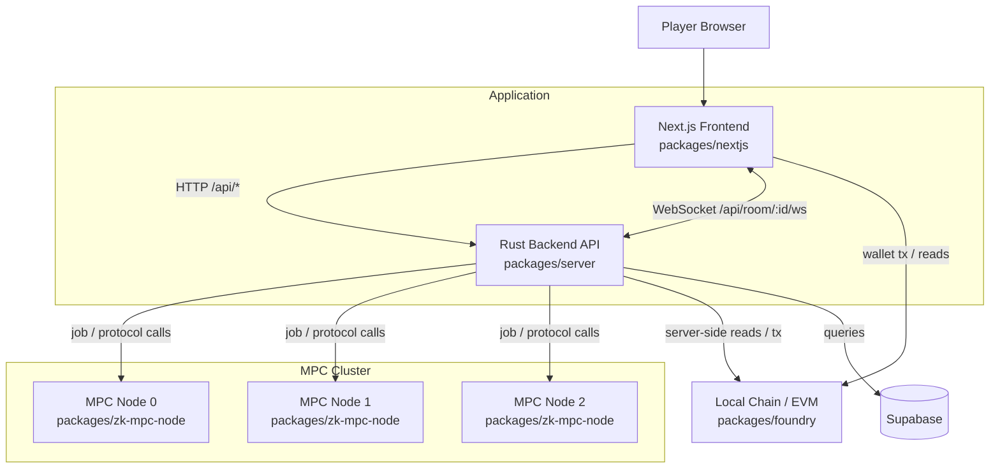

# ZK Werewolf

ZK Werewolf is a privacy-preserving social deduction game that combines zero-knowledge proofs (ZK) and secure multi-party computation (MPC).

Players can play Werewolf while keeping sensitive information (such as role details and private actions) hidden from other players and from central server logic.

## What Is ZK Werewolf?

ZK Werewolf is designed to keep game integrity and privacy at the same time:

- Privacy-focused gameplay using ZK/MPC-assisted computation flows
- Real-time multiplayer rooms with WebSocket updates
- Smart-contract integration for game-related on-chain workflows
- Multi-service architecture for frontend, backend, blockchain, and MPC nodes

## Core Concepts

### Privacy Model

- The frontend handles player interaction and encrypted payload preparation.
- The backend orchestrates room/game flow and API/WebSocket communication.
- MPC nodes process proof-related workloads.
- Smart contracts can be used for on-chain state/proof-related workflows.

### Game Flow (high level)

A typical game moves through:

`Night -> DivinationProcessing -> Discussion -> Voting -> Result`

The backend coordinates phase progression and broadcasts updates to clients.

## Quick Start (Local)

### Prerequisites

- Docker and Docker Compose

### Option A: Run full stack with Docker Compose

```bash
docker compose up --build
```

Main local endpoints:

- Frontend: `http://localhost:3000`
- Backend API: `http://localhost:8080`
- Backend health check: `http://localhost:8080/health`
- Blockchain RPC: `http://localhost:8545`
- MPC nodes: `http://localhost:9000`, `http://localhost:9001`, `http://localhost:9002`

Useful commands:

```bash
# Start in background
docker compose up --build -d

# Show logs
docker compose logs -f

# Stop stack
docker compose down --remove-orphans
```

### Option B: Use Make targets for local components

```bash
# Show available commands
make help

# Start frontend only
make frontend

# Start backend only
make server

# Start MPC nodes (small Groth16 keys profile)
make node-small

# Stop processes by known ports
make stop
```

## Architecture


```mermaid
flowchart TD
  Player[Player Browser]

  subgraph App["Application"]
    FE[Next.js Frontend\npackages/nextjs]
    BE[Rust Backend API\npackages/server]
  end

  subgraph MPC["MPC Cluster"]
    MPC0[MPC Node 0\npackages/zk-mpc-node]
    MPC1[MPC Node 1\npackages/zk-mpc-node]
    MPC2[MPC Node 2\npackages/zk-mpc-node]
  end

  Chain[Local Chain / EVM\npackages/foundry]
  DB[(Supabase)]

  Player --> FE
  FE -->|HTTP /api/*| BE
  FE <-->|WebSocket /api/room/:id/ws| BE

  BE -->|job / protocol calls| MPC0
  BE -->|job / protocol calls| MPC1
  BE -->|job / protocol calls| MPC2

  FE -->|wallet tx / reads| Chain
  BE -->|server-side reads / tx| Chain

  BE -->|queries| DB
```

## Repository Map

- `packages/nextjs/`: Next.js frontend (UI, wallet integration, gameplay interaction)
- `packages/server/`: Rust backend (room/game lifecycle, REST API, WebSocket events)
- `packages/zk-mpc-node/`: MPC node service used for proof-related computation
- `packages/mpc-circuits/`: Circuit-related logic used by proof workflows
- `packages/mpc-algebra-wasm/`: WASM bindings used by frontend/server proof-related flows
- `packages/foundry/`: Solidity contracts and local chain/deployment scripts
- `terraform/`: AWS infrastructure definitions
- `scripts/`: deployment/update helper scripts

## API Entry Points (Current)

Backend base URL (local): `http://localhost:8080`

- `GET /health`
- `/api/users/*` (user registration/login/user info)
- `/api/room/*` (room create/list/join/leave/ready/ws)
- `/api/game/*` (game lifecycle, phase actions, proof-related endpoints)
- `/api/nodes/keys/*` (node key registration/query)

WebSocket example:

```bash
websocat ws://localhost:8080/api/room/{roomId}/ws
```

## AWS Deployment

### Prerequisites

1. **AWS CLI** with SSO configured
2. **Terraform** >= 1.2.0
3. **Docker** for building images
4. **SOPS** (optional, for secrets management)
   ```bash
   brew install sops
   ```

### AWS Authentication

```bash
# Login via AWS SSO
aws-sso-util login

# Set AWS profile (required for all AWS operations)
export AWS_PROFILE=yoii-crypto-dev.AWSAdministratorAccess
```

### Terraform Setup

```bash
# Navigate to terraform environment
cd terraform/environments/dev

# Login to Terraform Cloud
terraform login

# Initialize
terraform init

# Plan and apply
terraform plan
terraform apply
```

### Docker Build & Push to ECR

Use the deployment script to build and push Docker images:

```bash
# Deploy all services
./scripts/deploy-to-ecr.sh dev

# Deploy specific service
./scripts/deploy-to-ecr.sh dev frontend
./scripts/deploy-to-ecr.sh dev backend
./scripts/deploy-to-ecr.sh dev mpc-node

# Skip build and push existing images
./scripts/deploy-to-ecr.sh dev --skip-build
```

#### Manual Build (Alternative)

```bash
# Set AWS profile
export AWS_PROFILE=yoii-crypto-dev.AWSAdministratorAccess

# Get ECR repository URLs from Terraform
cd terraform/environments/dev
export FRONTEND_REPO=$(terraform output -raw frontend_repository_url)
export BACKEND_REPO=$(terraform output -raw backend_repository_url)

# Login to ECR
aws ecr get-login-password --region ap-northeast-1 | \
  docker login --username AWS --password-stdin 719037119908.dkr.ecr.ap-northeast-1.amazonaws.com

# Build and push (from project root)
cd ../../..
docker build -f packages/nextjs/Dockerfile -t ${FRONTEND_REPO}:latest .
docker push ${FRONTEND_REPO}:latest
```

### Update ECS Service

After pushing new images, update ECS services:

```bash
# Update all services
./scripts/update-ecs-service.sh dev

# Update specific service
./scripts/update-ecs-service.sh dev frontend
./scripts/update-ecs-service.sh dev backend
```

### Full Deployment Flow

```bash
# 1. Set AWS profile
export AWS_PROFILE=yoii-crypto-dev.AWSAdministratorAccess

# 2. Build and push images
./scripts/deploy-to-ecr.sh dev

# 3. Update ECS services
./scripts/update-ecs-service.sh dev

# 4. Check deployment status
aws ecs describe-services \
  --cluster zk-werewolf-dev \
  --services frontend backend \
  --query 'services[*].{name:serviceName,status:status,running:runningCount,desired:desiredCount}'
```

### Access Deployed Application

```bash
# Get ALB DNS name
cd terraform/environments/dev
terraform output application_url
```

For detailed infrastructure documentation, see [terraform/README.md](terraform/README.md)
