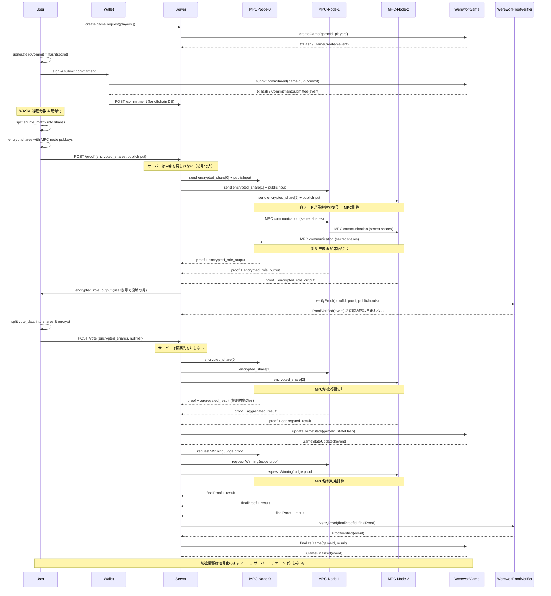

## フロー概要

このドキュメントは、プレイヤー（ユーザー）、バックエンドサーバー（オフチェーン）、ZK-MPCノード（証明生成）、およびブロックチェーン（スマートコントラクト）間でやり取りされる値とイベントを工程別に列挙します。特にチェーン周りのトランザクション、格納データ、イベント、検証手順を重点的に記述します。

共通表記:
- `gameId` : `bytes32` 相当のゲーム識別子
- `commitment` : `bytes32`（Pedersen/その他のコミットメント）
- `stateHash` : ゲーム状態の決定論的ハッシュ（Keccak256 / Merkle root）
- `proof` : ZK証明データ（bytes）
- `publicInputs` : 証明の公開入力（bytes / 各プロトコルに依存）
- `txHash`, `receipt.status`, `blockNumber` : トランザクション結果

アクター:
- ユーザー (User / Wallet)
- サーバー (Backend API / Game server)
- ZK-MPCノード (Proof Manager / MPC cluster)
- ブロックチェーン (WerewolfGame, WerewolfProofVerifier, WerewolfRewards コントラクト)

---

## フェーズ別フロー

1) ゲーム作成（Setup）

- ユーザー → サーバー
	- リクエスト: ゲーム作成要求（参加プレイヤーのアドレス一覧, メタデータ）
	- サーバーは `gameId = pad_32bytes(game_id)` を算出し、オフチェーンに初期 `Game` エントリを作成。

- サーバー → チェーン
	- トランザクション: `createGame(bytes32 gameId, address[] players, bytes32 rulesHash)` を送信。
	- 格納: `games[gameId] = GameState{ stateHash: 0x0, players, startTime, status: Waiting, ... }`
	- 発火イベント: `GameCreated(gameId, players, timestamp)`
	- 受信側の重要値: `txHash`, ブロック確定後の `receipt.status`（成功/失敗）、`blockNumber`。

注: この時点でチェーンは公式のゲーム存在を持つので、オンチェーン参照が可能になる。

2) コミットメント提出（Commit）

このフェーズで提出する `commitment` は **参加者の「匿名IDコミット（idCommit）」** として固定する。
後続のZK回路（メンバーシップ証明・二重行動防止nullifier等）の基礎になるため、**正史はオンチェーン**に置く。

- ユーザー → ウォレット
	- ユーザーが秘密値（secret）から `idCommit = hash(secret)` を生成。
	- ウォレットで署名を作成。

- ウォレット → チェーン（推奨フロー）
	- トランザクション: `submitCommitment(bytes32 gameId, bytes32 idCommit)` を直接送信（`msg.sender` = プレイヤーアドレス）。
	- 格納: `commitments[gameId][playerAddress] = PlayerCommitment{commitment, timestamp}`
	- 発火イベント: `CommitmentSubmitted(gameId, player, commitment)`
	- 受信確認: `txHash`, `receipt.status`。失敗時はリトライ戦略を用意。

- ウォレット → サーバー（並行処理）
	- 送信: `idCommit` をサーバーAPIへPOST（オフチェーンDB保存用）。
	- サーバーは署名検証し、チェーンとの整合性確認後、タイムスタンプ付きでDB保存。

重要な秘密情報管理:
- **ユーザーの秘密値（secret）はウォレット内でのみ管理。サーバー・チェーンには送信しない。**
- コミットメント値（idCommit）のみがチェーンに記録され、後続の証明で使用される。

3) 役職配布・秘密処理と証明生成（Role Assignment & Proof Generation）

**秘密情報の暗号化フロー（ZK-MPC）:**

- ユーザー（ブラウザ内WASM処理）
	- 秘密入力生成: `shuffle_matrix`（役職シャッフル用の置換行列）、`player_randomness` などを生成。
	- **秘密分散**: 秘密入力を Shamir秘密分散でシェアに分割（例：3つのシェア、閾値2）。
	- **暗号化**: 各シェアを対応する MPCノードの公開鍵（Ed25519）で暗号化。
	- 公開入力準備: `numPlayers`, `groupingParameter`, `tauMatrix`, `playerCommitment[]` など。

- ユーザー → サーバー
	- 送信: `{ proof_type: "RoleAssignment", encrypted_shares: [...], public_input: {...}, user_public_key }` をPOST。
	- **重要**: サーバーは暗号化されたシェアを受け取るのみ。**復号できない**ため秘密情報（役職等）を知ることはできない。

- サーバー → 各MPCノード（3ノード並行）
	- 転送: 暗号化シェアと公開入力を各ノードにHTTP POSTで送信。
	- サーバーは「暗号化データの転送エージェント」として機能。中身は見られない。

- 各MPCノード内部処理（秘密分散計算）
	1. **復号**: 自ノードの秘密鍵で暗号化シェアを復号 → 秘密分散シェアを取得。
	2. **MPC計算**: ノード間通信で秘密分散のまま役職配布計算を実行（shuffle行列の積、置換適用など）。
	3. **証明生成**: ZK証明（Marlin）を生成。各ノードが独立に証明を計算。
	4. **結果暗号化**: 計算結果（役職割当等）をユーザーの公開鍵で暗号化（各ノードが同じ結果を得る）。

- 各MPCノード → サーバー
	- 返却: `{ proof, publicInputs, encrypted_output }` を各ノードが返す。
	- サーバーは全ノード（3つ）からの応答を収集・検証（整合性チェック）。

- サーバー → ユーザー
	- 配信: 暗号化された役職情報 `encrypted_output`。ユーザーは自分の秘密鍵で復号して役職を知る。
	- **重要**: サーバーは暗号化されたままなので役職を知らない。

- サーバー → チェーン（オンチェーン検証）
	- トランザクション: `verifyProof(bytes32 proofId, bytes proof, bytes publicInputs)` を送信。
	- **チェーンに記録される情報**: 証明データと公開入力（`playerCommitment[]`, `tauMatrix` 等）のみ。**役職情報は含まれない**。
	- 検証成功時: `ProofVerified(proofId, gameId, ProofType.RoleAssignment, timestamp)` イベントが発火。
	- 検証失敗時: `ProofFailed` イベントが発火。
	- 受信側: `receipt.status` と `ProofVerified` イベントで検証完了を確認。

重要な秘密情報管理:
- **ユーザーの秘密入力（shuffle_matrix等）はMPCノード間でのみ秘密分散として存在。サーバー・チェーンは知らない。**
- **役職情報は暗号化されてユーザーにのみ配信。サーバー・チェーンは知らない。**
- **チェーンでは「正しく計算された」ことのみ検証。計算内容（誰が何の役職か）は秘密のまま。**

4) 夜の行動・投票（Action & Voting）

**秘密投票の暗号化フロー:**

- ユーザー（ブラウザ内WASM処理）
	- 秘密入力生成: 投票先ID、匿名ID証明用のnullifier、メンバーシップ証明用のパスなど。
	- **秘密分散・暗号化**: 投票情報を秘密分散し、各MPCノードの公開鍵で暗号化。

- ユーザー → サーバー
	- 送信: `{ proof_type: "AnonymousVoting", encrypted_shares: [...], public_input: {...} }` をPOST。
	- **重要**: サーバーは誰が誰に投票したかを知らない（暗号化されているため）。

- サーバー → 各MPCノード
	- 転送: 暗号化シェアを各ノードに送信。サーバーは中身を見られない。

- 各MPCノード内部処理
	1. **復号**: 自ノードの秘密鍵で復号 → 秘密分散シェアを取得。
	2. **MPC計算**: 秘密分散のまま投票集計、匿名性証明、二重投票チェック等を実行。
	3. **証明生成**: ZK証明を生成（投票の正当性、匿名性保持）。
	4. **結果計算**: 集計結果（誰が処刑されたか）を計算。個別の投票内容は秘密のまま。

- 各MPCノード → サーバー
	- 返却: `{ proof, publicInputs, aggregated_result }` を返す。
	- `aggregated_result`: 処刑対象プレイヤーIDのみ（個別の投票は含まれない）。

- サーバー → チェーン
	- 状態更新: `updateGameState(bytes32 gameId, bytes32 stateHash)` を送信。
		- `stateHash` は、投票後の決定論的ハッシュ（プレイヤー生存状態、処刑記録のハッシュ等）。**個別の投票内容は含まれない**。
	- 発火イベント: `GameStateUpdated(gameId, stateHash, timestamp)`
	- チェーンに最新状態を記録（誰が処刑されたかは記録、誰がどう投票したかは秘密）。

重要な秘密情報管理:
- **投票内容は秘密分散のまま計算され、結果のみ公開。**
- **サーバー・チェーンは個別の投票内容を知らない。**

5) 勝利判定・最終証明（Judgement & Finalization）

- サーバー → ZK-MPCノード
	- 最終判定のための証明生成要求（WinningJudgement proof）。MPC は内部ロジックとコミットメントを使い `proof` を作成。

- ZK-MPCノード → サーバー
	- 返却: `proof`, `publicInputs`, `finalStateHash`。

- サーバー → チェーン
	- まずオンチェーンで証明を検証: `verifyProof(proofId, proof, publicInputs)`。
	- 検証成功後、最終状態を更新し `finalizeGame(bytes32 gameId, GameResult result)` を呼び出す。
		- これにより `GameFinalized(gameId, result, timestamp)` が発火し、`games[gameId].status` が `Finished` にセットされる。
	- その後必要に応じて報酬分配: `distributeRewards(bytes32 gameId, address[] winners)` を実行（`WerewolfRewards` コントラクト）。
	- 各トランザクションについて、`txHash` と `receipt.status`、イベントログの `ProofVerified` / `GameFinalized` / `RewardsDistributed` を検証してワークフローを完了させる。

チェーン上の最終整合性チェック:
- `stateHash` の一貫性: オフチェーンの `compute_game_state_hash(game)` とチェーン上に保存された `games[gameId].stateHash` を比較。
- 証明の相関: `proofId`（例えば `keccak256(batchId)`）をキーに、チェーン上 `proofs[proofId]` が `verified=true` になっていること。

---

## エラー処理と再試行戦略（チェーン重視）

- トランザクション失敗 (receipt.status = 0):
	- 自動リトライ（exponential backoff）を実装。
	- nonce やガス見積もりが原因の場合は再取得して再送信。

- RPC 一時障害:
	- 複数 RPC ノード（ローカル Anvil、Alchemy、Infura）をフォールバックで利用。

- 証明検証失敗:
	- `ProofFailed` イベントをログに残し、該当証明を再生成またはオフチェーンでの二次検証を行う。

---

## オンチェーン設計上の推奨事項（要点）

- 可能な限り小さな公開入力を設計し、ガスコストを抑える（Merkle root やハッシュのみチェーンに置く）。
- 単一プレイヤーの直接呼び出し（`submitCommitment` 等）を優先し、バックエンド代理送信は最小化する。
- 重要イベント（`GameCreated`, `CommitmentSubmitted`, `GameStateUpdated`, `ProofVerified`, `GameFinalized`, `RewardsDistributed`）を必ず発火し、オフチェーンはイベントログを信頼の根拠にする。
- 証明ID とゲームID の一意性を保証し、replay や二重請求を防止する。

---

## 付録：メッセージ/データ一覧（簡易）

- `createGame` (tx) => stores: `games[gameId]` ; emits `GameCreated`
- `submitCommitment` (tx) => stores: `commitments[gameId][player]` ; emits `CommitmentSubmitted`
- `updateGameState` (tx) => updates: `games[gameId].stateHash` ; emits `GameStateUpdated`
- `verifyProof` (tx) => writes: `proofs[proofId].verified` ; emits `ProofVerified` / `ProofFailed`
- `finalizeGame` (tx) => writes: `games[gameId].status/result` ; emits `GameFinalized`
- `distributeRewards` (tx) => transfers ETH/ERC20 ; emits `RewardsDistributed` / `RewardClaimed`

このファイルを起点に、必要ならば各フローをシーケンス図やMermaid図に落とし込みます。変更や追加項目があれば指示してください。

## シーケンス図（Mermaid）

